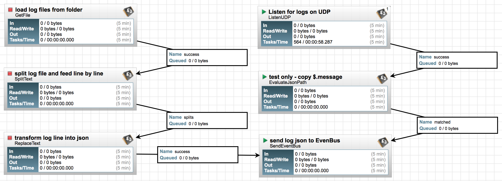
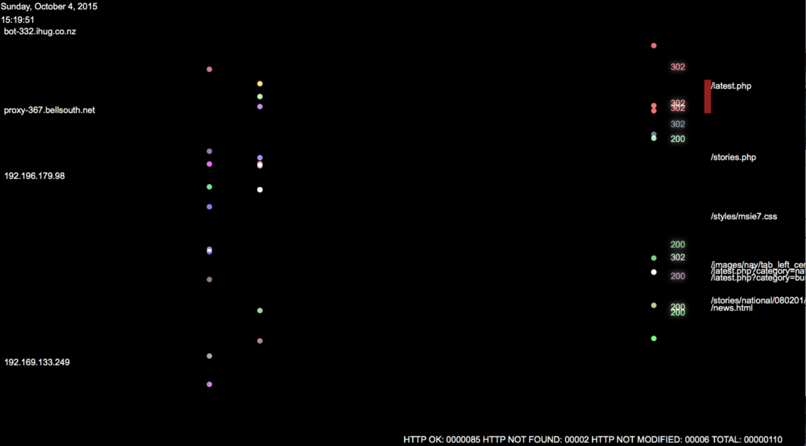

collect-stream-logs
===================

1. Ingest logs from folders.
2. Listen for syslogs on UDP port.
3. Merge syslogs and drop-in logs and persist merged logs to Solr for historical search.  
4. Dashboard: stream real-time log events to dashboard and enable cross-filter search on historical logs data. 
you can genrate logs samples from below link:
Note: this flow depends on **nifi-websocket** module, download [nar](https://github.com/xmlking/nifi-websocket/releases/download/0.1.0/nifi-websocket-0.1.0-SNAPSHOT.nar) and copy to `$NIFI_HOME/lib`

### Run log generator
```bash
gradle :collect-stream-logs:log-generator:run
```

### Flow


### Demo



